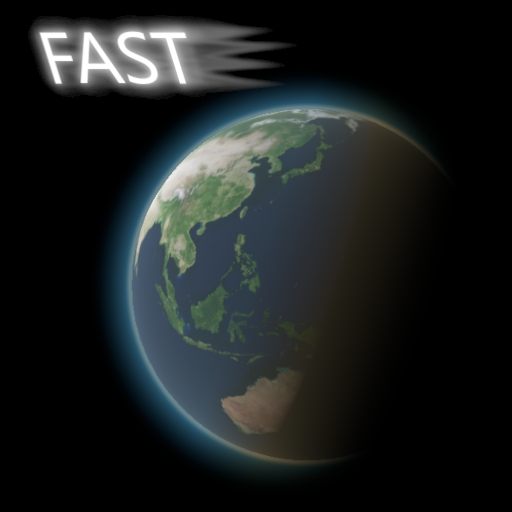
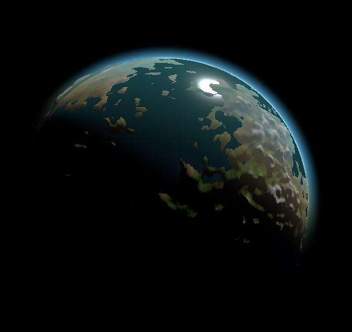
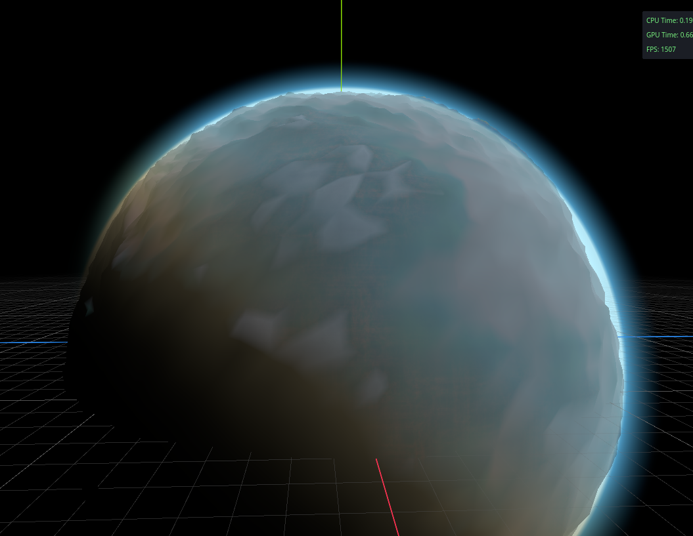
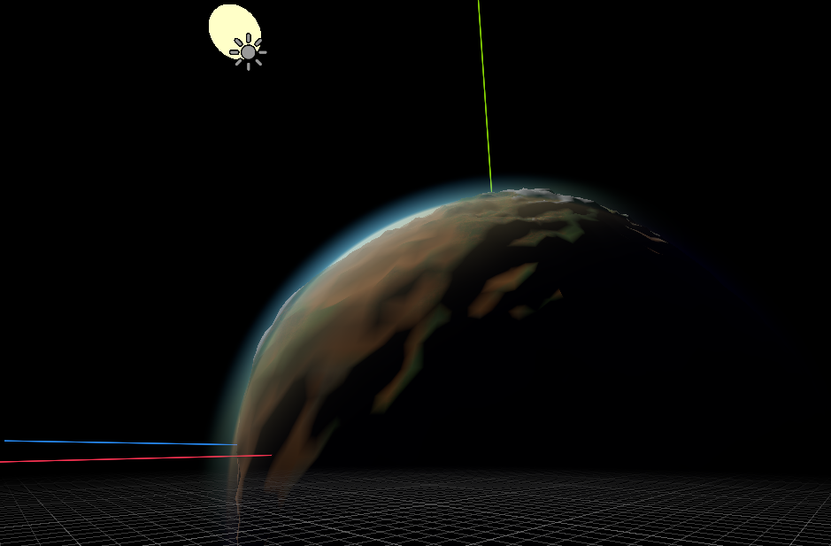
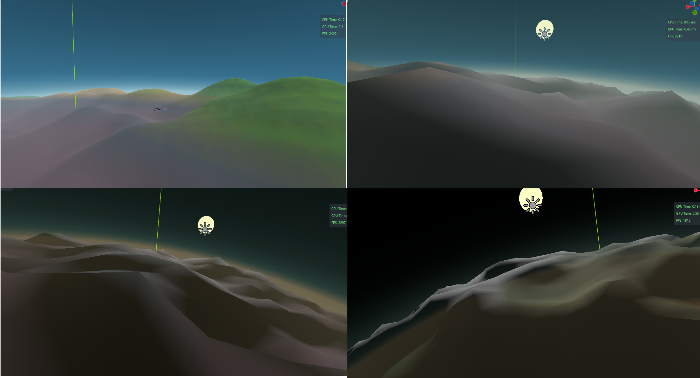
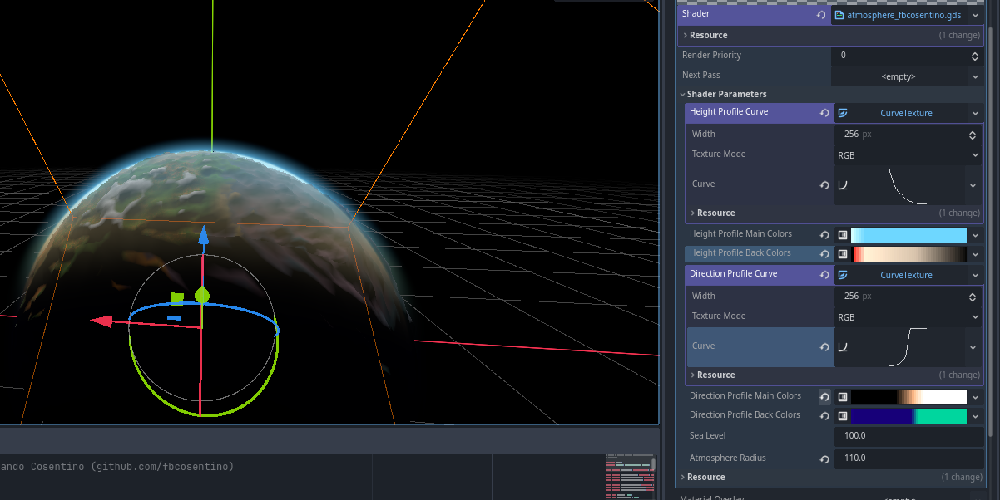
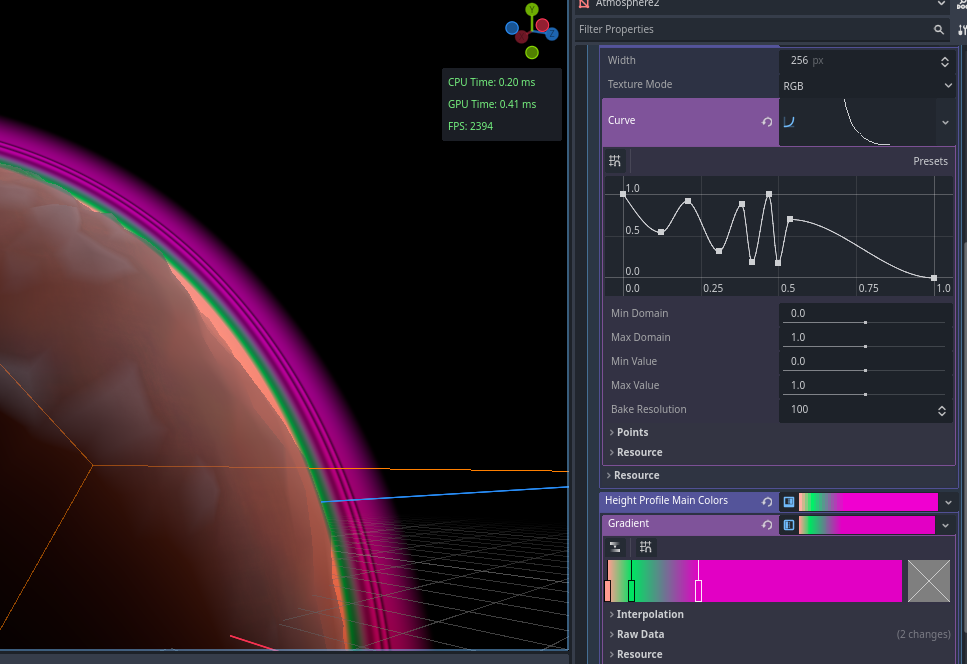
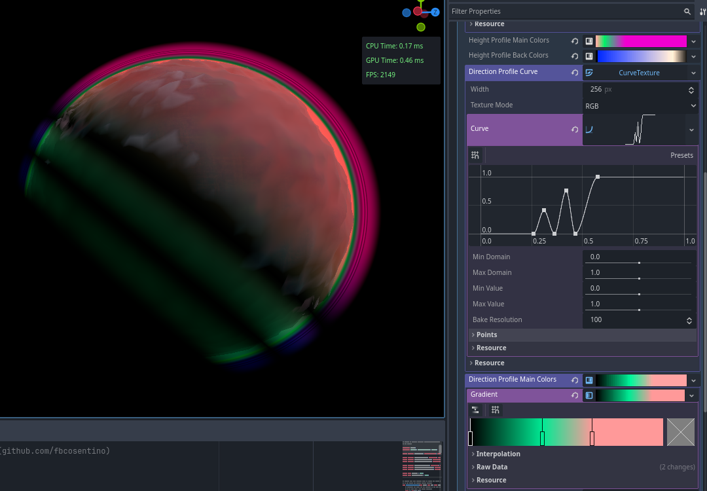

# Extremely Fast Atmosphere Plugin for Godot 4.x with Forward+

A (spherical) planet atmosphere system for Godot which does not use any form of ray marching and has no loops in the shader at all. It is not only fast, but also extremely customisable.

----

This is a spherical atmosphere shader based on a single, simple cube mesh placed around your planet (rendering on top of it with depth disabled).

Unlike ray marching shaders, it does not have any `for` loops in the fragment pass (let alone nested loops), and also doesn't use any trigonometric functions (no `sin`,`acos`, `atan`, etc). Instead it uses as much information as possible baked into textures (color and curves). The worst it gets mathwise (apart from usual matrix transformations) is a bunch of `dot` calls. The performance is on the same order of magnitude as a `StandardMaterial3D`.

When seen from outside, it looks like the typical atmospheric shell around the planet. When the camera is inside, it doubles as sky and fog, with colors and density following sun direction and height.

----

## Installation

Install the plugin into your addons folder as usual, and activate it.

Add the node from `res://addons/extremely_fast_atmosphere/atmosphere/atmosphere.tscn` into your scene, and adjust the planet radius and atmosphere height properties.

Optionally you can set a node to track the sun position. If you don't have one, you can control the atmosphere direction simply by rotating the node.

----

## Customising

There are _a lot_ of options to customize:

There are two profiles, each one with a curve and two gradient colors. The two color gradients are _Main_ and _Back_ colors:

- Main color is the color you normally see when you look at the planet from most angles

- Back color is the color you see when you look from the side opposed to the sun. This is mainly used to make a "halo" around the horizon after the sun has set, or is setting. In most cases, for Earth-like, you'll have it close to black with sunset warm or blueish "northern lights" tones

### Height Profile

_**Note:** The height profile is **not** related to from which angle and longitude (time of day) you see the atmosphere. This profile applies to all viewing angles._

This curve controls how the atmosphere density decreases with height (respective to the density overall value further down the shader parameters). Normally you'll have maximum density near the surface (left side) and zero when leaving the atmosphere (right side), but you can have all sorts of variations and bands along the way. You can even have it reverse for a "force field shield" effect.

The height main color gradient controls how the atmosphere is tinted differently when close to the surface or further out. This is _not_ related to time of day or sun angle (for those, see the other profile). From outside, this is mostly seen as the gradient on the circular horizon. The surface of the planet itself will be mostly uniformly tinted to the color on the leftmost side of the gradient. When seen from inside, this will be the sky gradient from horizon to top sky.

In the example, the height main colors are blue for most heights, but less saturated (towards white) near the surface.

The height back colors are how the colors change in height when you are in the night side of the planet, looking towards the (probably invisible) sun. While this profile is not entirely related to sun angle, the fact it only shows up when seeing the atmosphere against the sun from a dark place, means it can be used to draw a color gradient on the horizon for sun dawns and sets.

In the example, this gradient uses a strong red color touching the horizon, and golden colors higher up fading to black at top.

## Direction Profile

_**Note:** The direction profile **is** related to from which angle and longitude (time of day) you see the atmosphere. This profile lets you set the basic "C" appearance of the atmosphere shell, as well as overall sky color for different times of day._

The curve controls the atmosphere density for each longitude across the planet surface, where left side is the meridian totally opposed to the sun (midnight), and the right side is the meridian exactly under sun (midday).

The example has full density on all the diurne side, and decaying density on the nocturne one with the lowest point at midnight.

The main color gradient sets the color perceived on the atmosphere when seeing the planet from outside, and basic sky color when inside the planet, including day and night.

The example has the day side as full white (in order not to overtint the already blue height profile), and the night side full black, with an orangeish tint on dawn/dusk hours.

The back gradient, as before, is the color seen for each longitude when looking at the atmosphere from the night side. When seen from outside, this is the faint halo around the planet when the planet eclipses the sun. When seen from inside, this is the sky tint towards the direction the sun has set or will rise. The example has a deep blue for all the night side, and a faint ionized oxygen (aka "night glow") cyan tint towards the (usually invisible) sun.

## Watersphere

The most recent version includes a watersphere profile, allowing you to tint depths below sea level, with its own density curve. It is currently experimental and kinda broken. It's disabled when water density is set to zero (default).

## Combinations

Avoid tinting both the height and the direction colors unless you know what you're doing. They are multiplied, so overtinting can ruin your expectations. Best way to deal with is to have colors on one of the gradients (between height and direction), and black/white shades on the other to control brightness, with only weak or occasional colors. But feel free to experiment.

Irregularities in the height profile create height rings, while irregular direction profile creates bands around the planet perpendicular to sun direction.

This example also shows overtinting in action: the height profile has bright magenta for higher altitudes, while the direction profile has neon green bands on the night side. The result is the high atmosphere inside the night bands ended up dark blue as they multiply each other.

Having a high value on the right side of the height profile curve creates a "force shield" effect:

